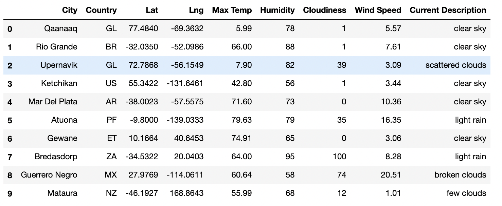

# World_Weather_Analysis
## Overview
PlanMyTrip is a top travel company that specializes in internet services related to hotels and lodging. It aims to provide sufficient results online by collecting data and filtering it based on the preferences of their customers. Clients may find their ideal hotel based on multiple filters such as geopraphical location and current weather. In order to promote the app to the next level, the addition of weather descriptions to the weather data collected will offer travelers a first-rate experience. Narrowing options based on preference will allow clients to select from a smaller list of hotels with the most desirable climate. Lastly, the inclusion of a travel itinerary with direction routes will offer the ultimate experience: four cities with their own hotels plus the method and distance of the journey.

## Results
### Process
In order to begin the analysis, the module NumPy generates 2,000 random latitudes and longitudes. With this data gathered and organized it is now possibile to manipulate into an interactive mapping platform with which users will be able to filter. 

The citipy module then located the nearest city to these locations. After generating API keys from OpenWeatherMap and the Google Maps and Places API, the latest weather conditions and locations
can be generated and visualized. Customers can now view a large interactive map and select from a large amount of loactions that fit their preference. 

Once FindMyTrip has enough information from the customer, it can generate a multiple-city trip in which four cities are selected and connected by a directional route. This is possible with the use of an API key from Google Directions API. For this analysis, Australia is selected as the travel destination and a travel route which pinpoints four corners of the country is provided. 

Finally, summary table pop-up is available with the best hotel option in each city, the country code, a weather description and the current temperature. This gives a user on the website a surplus of information. The site organizes and details a trip so you will not have to. 

## Summary
The PlanMyTrip experience is simple to use and effective for motivated travelers. Working for this tech company would require skills with multiple modules and softwares including Python (Pandas, NumPu, citipy), jupyter notebook, parsing JSON data  and working with API keys to gether data from companies such as OpenWeahterApp and Google. The end results, when exected correctly provide customers with the ultimate travel experience.  

